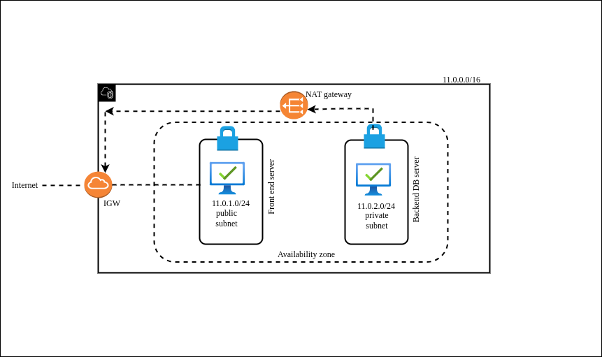

#  AWS Two-Tier Architecture Setup

> **Secure Frontend + Backend Architecture with Public EC2 and Private MySQL Server**

A comprehensive guide to building a production-ready two-tier architecture on AWS with a public-facing web server and a secure private MySQL database.

## 🎯 Overview

This guide demonstrates how to set up a secure two-tier architecture on AWS with:

- **Public Tier**: Frontend web server (EC2) with internet access
- **Private Tier**: MySQL database server (EC2) isolated from public internet
- **Secure Communication**: Frontend can access backend via private network
- **Internet Access for Private Server**: NAT Gateway enables outbound connections

### Key Features

✅ **Security**: Database isolated from public internet  
✅ **Scalability**: Easy to add more servers to each tier  
✅ **High Availability**: Multi-AZ deployment ready  
✅ **Cost-Effective**: Uses AWS free tier eligible resources

---

## 📊 Architecture Diagram





## 🔧 Prerequisites

Before starting, ensure you have:

- [ ] AWS Account with appropriate permissions
- [ ] Basic understanding of networking concepts (VPC, subnets, routing)

### Required AWS Services

- **VPC** (Virtual Private Cloud)
- **EC2** (Elastic Compute Cloud)
- **Internet Gateway**
- **NAT Gateway**
- **Elastic IP**

---

## 🚀 Step-by-Step Setup

### 1. Create VPC

**Navigate to:** AWS Console → VPC → Create VPC

| Setting | Value |
|---------|-------|
| **Name** | `my-project-vpc` |
| **IPv4 CIDR** | `10.0.0.0/16` |

**Steps:**
1. Go to VPC Dashboard
2. Click **Create VPC**
3. Enter the values from the table above
4. Click **Create VPC**

> 💡 **Tip**: The CIDR block `10.0.0.0/16` provides 65,536 IP addresses for your infrastructure.

---

### 2. Create Subnets

#### 2.1 Public Subnet (For Frontend)

**Navigate to:** VPC → Subnets → Create Subnet

| Setting | Value |
|---------|-------|
| **Subnet Name** | `public-subnet` |
| **VPC** | `my-project-vpc` |
| **Availability Zone** | `ap-south-1a` |
| **IPv4 CIDR** | `10.0.1.0/24` |

**Enable Auto-assign Public IP:**
1. Select the subnet
2. Actions → **Edit subnet settings**
3. ✅ Enable **Auto-assign public IPv4 address**
4. Save

#### 2.2 Private Subnet (For Database)

| Setting | Value |
|---------|-------|
| **Subnet Name** | `private-subnet` |
| **VPC** | `my-project-vpc` |
| **Availability Zone** | `ap-south-1a` |
| **IPv4 CIDR** | `10.0.2.0/24` |
| **Auto-assign Public IP** | ❌ Disabled |

> ⚠️ **Important**: Keep auto-assign public IP **disabled** for the private subnet to maintain security.

---

### 3. Attach Internet Gateway

**Navigate to:** VPC → Internet Gateways → Create Internet Gateway

**Steps:**
1. Click **Create Internet Gateway**
2. **Name**: `my-igw`
3. Click **Create**
4. Select the IGW → Actions → **Attach to VPC**
5. Select `my-project-vpc`
6. Click **Attach**

> 📘 **What it does**: Allows resources in the public subnet to communicate with the internet.

---

### 4. Configure Route Tables

#### 4.1 Public Route Table

**Navigate to:** VPC → Route Tables → Create Route Table

1. **Name**: `public-route-table`
2. **VPC**: `my-project-vpc`
3. Click **Create**

**Add Routes:**
1. Select the route table
2. **Routes** tab → **Edit routes**
3. Click **Add route**

| Destination | Target |
|-------------|--------|
| `0.0.0.0/0` | Internet Gateway (`igw-xxxxx`) |

4. Click **Save changes**

**Associate with Public Subnet:**
1. **Subnet associations** tab → **Edit subnet associations**
2. Select `public-subnet`
3. Click **Save associations**

#### 4.2 Private Route Table

1. **Name**: `private-route-table`
2. **VPC**: `my-project-vpc`
3. Click **Create**

**Associate with Private Subnet:**
1. **Subnet associations** tab → **Edit subnet associations**
2. Select `private-subnet`
3. Click **Save associations**

> 📌 **Note**: We'll add the NAT Gateway route in the next step.

---

### 5. Create NAT Gateway

#### 5.1 Allocate Elastic IP

**Navigate to:** VPC → Elastic IPs → Allocate Elastic IP address

1. Click **Allocate**
2. Note the Elastic IP address (e.g., `13.232.xxx.xxx`)

#### 5.2 Create NAT Gateway

**Navigate to:** VPC → NAT Gateways → Create NAT Gateway

| Setting | Value |
|---------|-------|
| **Name** | `my-nat-gateway` |
| **Subnet** | ⚠️ `public-subnet` (IMPORTANT) |
| **Elastic IP** | Select the allocated EIP |

1. Click **Create NAT Gateway**
2. Wait 1-2 minutes for status to become **Available**

#### 5.3 Add NAT Gateway to Private Route Table

1. Go to **Route Tables**
2. Select `private-route-table`
3. **Routes** tab → **Edit routes**
4. Click **Add route**

| Destination | Target |
|-------------|--------|
| `0.0.0.0/0` | NAT Gateway (`nat-xxxxx`) |

5. Click **Save changes**

> ✅ **Result**: Private subnet can now access the internet for updates/patches while remaining inaccessible from the internet.

---

### 6. Launch EC2 Instances

#### 6.1 Frontend Server (Public EC2)

**Navigate to:** EC2 → Instances → Launch Instance

##### Instance Configuration

| Setting | Value |
|---------|-------|
| **Name** | `frontend-webserver` |
| **AMI** | Ubuntu Server 22.04 LTS |
| **Instance Type** | `t2.micro` (Free tier) |
| **Key Pair** | Create or select existing |

##### Network Settings

| Setting | Value |
|---------|-------|
| **VPC** | `my-project-vpc` |
| **Subnet** | `public-subnet` |
| **Auto-assign Public IP** | ✅ Enable |

##### Security Group Configuration

**Name**: `frontend-sg`

| Type | Protocol | Port | Source | Description |
|------|----------|------|--------|-------------|
| SSH | TCP | 22 | Your IP | Remote access |
| HTTP | TCP | 80 | `0.0.0.0/0` | Web traffic |
| HTTPS | TCP | 443 | `0.0.0.0/0` | Secure web traffic |

**Steps:**
1. Fill in the configuration
2. Review and **Launch Instance**
3. Wait for instance state: **Running**

#### 6.2 Backend Server (Private MySQL)

**Navigate to:** EC2 → Instances → Launch Instance

##### Instance Configuration

| Setting | Value |
|---------|-------|
| **Name** | `mysql-backend` |
| **AMI** | Ubuntu Server 22.04 LTS |
| **Instance Type** | `t2.micro` (Free tier) |
| **Key Pair** | Same as frontend |

##### Network Settings

| Setting | Value |
|---------|-------|
| **VPC** | `my-project-vpc` |
| **Subnet** | `private-subnet` |
| **Auto-assign Public IP** | ❌ Disable |

##### Security Group Configuration

**Name**: `mysql-backend-sg`

| Type | Protocol | Port | Source | Description |
|------|----------|------|--------|-------------|
| MySQL/Aurora | TCP | 3306 | `frontend-sg` | Database access from frontend only |
| SSH | TCP | 22 | `frontend-sg` | Admin access via bastion |

> 🔒 **Security Note**: Only the frontend server can access the MySQL server. No direct internet access.

**Steps:**
1. Fill in the configuration
2. Review and **Launch Instance**
3. Wait for instance state: **Running**

---

### 7. Install MySQL on Private Server

#### 7.1 Connect to Private Server

Since the private server has no public IP, connect through the frontend server (bastion):

**From your local machine:**
```bash
# SSH to frontend server
ssh -i your-key.pem ubuntu@<frontend-public-ip>

# From frontend, SSH to backend using private IP
ssh ubuntu@10.0.2.x
```

#### 7.2 Update System

```bash
sudo apt update
sudo apt upgrade -y
```

#### 7.3 Install MySQL Server

```bash
sudo apt install mysql-server -y
```

#### 7.4 Verify Installation

```bash
mysql --version
```

**Expected Output:**
```
mysql  Ver 8.0.44-0ubuntu0.24.04.1 for Linux on x86_64
```

#### 7.5 Secure MySQL Installation

```bash
sudo mysql_secure_installation
```

**Follow the prompts:**
- Set root password? → **YES**
- Remove anonymous users? → **YES**
- Disallow root login remotely? → **YES** (we'll configure this properly later)
- Remove test database? → **YES**
- Reload privilege tables? → **YES**

#### 7.6 Set Root Password

```bash
sudo mysql
```

Inside MySQL:
```sql
ALTER USER 'root'@'localhost' IDENTIFIED WITH mysql_native_password BY 'Dollar$6623';
FLUSH PRIVILEGES;
EXIT;
```

**Test login:**
```bash
mysql -u root -p
```
Enter password: `Dollar$6623`

---

### 8. Configure Remote Access

#### 8.1 Install MySQL Client on Frontend Server

**SSH to frontend server:**
```bash
ssh -i your-key.pem ubuntu@<frontend-public-ip>
```

**Install client:**
```bash
sudo apt update
sudo apt install mysql-client-core-8.0 -y
```

#### 8.2 Configure MySQL to Accept Remote Connections

**On the backend (MySQL) server:**

##### Step 1: Edit MySQL Configuration

```bash
sudo nano /etc/mysql/mysql.conf.d/mysqld.cnf
```

**Find and change:**
```ini
# Before
bind-address = 127.0.0.1

# After - Option 1: Allow all interfaces
bind-address = 0.0.0.0

# Or Option 2: Bind to private IP only (more secure)
bind-address = 10.0.2.x
```

**Save and exit**: `Ctrl + O` → `Enter` → `Ctrl + X`

##### Step 2: Restart MySQL

```bash
sudo systemctl restart mysql
sudo systemctl status mysql
```

#### 8.3 Create Remote Access User

**Login to MySQL:**
```bash
sudo mysql -u root -p
```

**Create admin user for remote access:**
```sql
-- Enable root for remote access (not recommended for production)
ALTER USER 'root'@'%' IDENTIFIED WITH mysql_native_password BY 'Dollar$6623';
GRANT ALL PRIVILEGES ON *.* TO 'root'@'%' WITH GRANT OPTION;

-- Create dedicated admin user (RECOMMENDED)
CREATE USER 'admin'@'%' IDENTIFIED WITH mysql_native_password BY 'AdminPass@123';
GRANT ALL PRIVILEGES ON *.* TO 'admin'@'%' WITH GRANT OPTION;

-- Apply changes
FLUSH PRIVILEGES;

-- Verify users
SELECT user, host FROM mysql.user;
EXIT;
```

**Expected Output:**
```
Query OK, 0 rows affected (0.01 sec)
Query OK, 0 rows affected (0.02 sec)
Query OK, 0 rows affected (0.00 sec)
```

---

## ✅ Testing & Verification

### Test 1: Verify MySQL is Running

**On backend server:**
```bash
sudo systemctl status mysql
```

**Expected:** `Active: active (running)`

### Test 2: Test Local Connection

**On backend server:**
```bash
mysql -u root -p
```

Should connect successfully.

### Test 3: Test Remote Connection from Frontend

**On frontend server:**
```bash
mysql -h 10.0.2.x -u admin -p
```

Enter password: `AdminPass@123`

**Expected Output:**
```
Welcome to the MySQL monitor.  Commands end with ; or \g.
mysql>
```

### Test 4: Verify Internet Access from Private Server

**On backend server:**
```bash
ping -c 4 google.com
sudo apt update
```

Should work via NAT Gateway.

---
## 📚 Additional Resources

- [AWS VPC Documentation](https://docs.aws.amazon.com/vpc/)
- [MySQL 8.0 Documentation](https://dev.mysql.com/doc/refman/8.0/en/)
- [AWS Well-Architected Framework](https://aws.amazon.com/architecture/well-architected/)
- [AWS Free Tier Details](https://aws.amazon.com/free/)

---

## 👨‍💻 Author

**GOKULRAJ**  
📧 Email: rajg73847@gmail.com  
🔗 LinkedIn: https://www.linkedin.com/in/gokul7402/  

---
